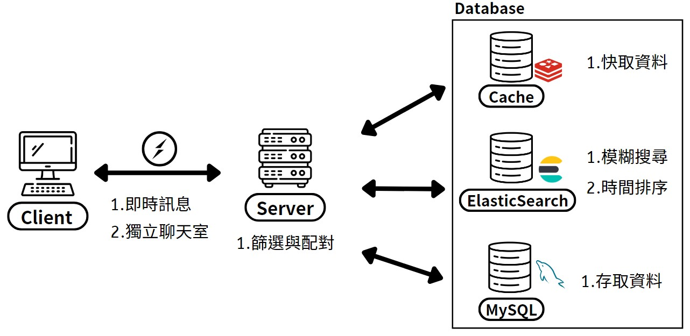

# GoDating

> Go easy, go dating !

Looking to meet your ideal match? Curious to know who's interested in you? Want to experience real-time chatting? Look no further than GoDating!

**Try It Now** -> [GoDating](https://mengtzu.site) (https://mengtzu.site)

**Test Accounts**

- Email: junggi@test.com / Password: 1234567 (凱光)
- Email: chiao@test.com / Password: 1234567 (小潔)
- Email: purple@test.com / Password: 1234567 (莎莉)
- Email: dragon@test.com / Password: 1234567 (小偉)

## Description

A dating website that provides personalized recommendation system, real-time messaging / notifications, and convenient search of chat history.

## Table of Contents

- [Description](#description)

- [Table of Contents](#table-of-contents)

- [Features](#features)

- [Demo](#demo)

- [Architecture](#architecture)

- [Database Schema](#database-schema)

  - [MySQL](#mysql)

  - [Elasticsearch](#elasticsearch)

- [Roadmap](#roadmap)

- [Contact Information](#contact-information)

- [Contribution](#contribution)

## Features

[(Back to top)](#godating)

- Leveraged a filter mechanism based on gender, sexual orientation and age to suggest
  suitable candidates to users.

- enabling real-time messaging and notifications.

- Facilitated convenient searching of chat history with fuzzy search functionality.

## Demo

[(Back to top)](#godating)

## Architecture

[(Back to top)](#godating)



## Database Schema

[(Back to top)](#godating)

### MySQL

- user information

  

### Elasticsearch

- chat record
  ```json
  {
    "userId": {
      "type": "integer"
    },
    "userName": {
      "type": "text"
    },
    "message": {
      "type": "text"
    },
    "timestamp": {
      "type": "text"
    },
    "time": {
      "type": "date",
      "format": "epoch_millis"
    }
  }
  ```

## Roadmap

[(Back to top)](#godating)

- **Interest-based Recommendations** : Refine recommendation system, prioritizing matches based on users' shared interests. Provide users with even more accurate and tailored suggestions.

- **Customizable Filtering Criteria** : Allow users to change their preferences to discover more potential candidates.

- **Proximity-based Match Discovery** : Enables users to explore potential individuals who share a geographical proximity and may have mutual interest.

- **Diversified Sexual Orientation Options** : Expand the range of sexual orientation options in the questionnaire survey to supports users in finding compatible partners.

## Contact Information

[(Back to top)](#godating)

- Name: Meng-Tzu Tsai 蔡孟慈

- Email: mengtzu07@gmail.com

- LinkedIn: https://linkedin.com/in/meng-tzu-tsai

If you have any suggestion or brilliant ideas to GoDating website, feel free to contact me!

## Contribution

[(Back to top)](#godating)

- Thanks [flaticon](https://www.flaticon.com) for providing free icons.

- Thanks [Unsplash](https://unsplash.com) and [Pexels](https://www.pexels.com/zh-tw) for providing free photographs.
